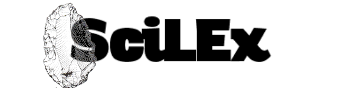
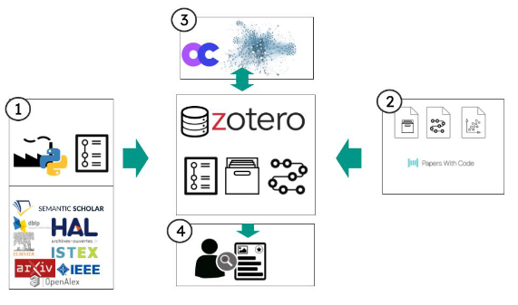

# SciLEx

The SciLEx (Science Literature Exploration) project is a basic python scriptbox made for :
* Request and run API crawler related to a research field
* Managing / Parsing / Deduplicating the collected papers
* Consolidate and Enrich a benchmark  
* Exploring the citations links and expanding a network of sci. papers

I developed ScilEx scripts in the context of a systematic review conducted during my Phd, and introduced in :  
> Celian Ringwald. Learning Pattern-Based Extractors from Natural Language and Knowledge Graphs: Applying Large Language Models to Wikipedia and Linked Open Data. AAAI-24 - 38th AAAI Conference on Artificial Intelligence, Feb 2024, Vancouver, France. pp.23411-23412, ⟨10.1609/aaai.v38i21.30406⟩. ⟨hal-04526050⟩
---
## SciLEx Framework

1. Crawl of already existing *surveys* on topic and push it on Zotero
2. Extract *models*, *dataset* from PaperWithCode and push it on Zotero
3. Get DOIs and obtain the citation network
4. Distill it with Zotero API / Annotate it on Zotero and distill your annotations

---

## :electric_plug: First steps
:heavy_plus_sign: [Install Zotero and Zotero Connector](https://www.zotero.org/download/)

:heavy_plus_sign: [Create a Zotero API key](https://www.zotero.org/support/dev/web_api/v3/start)

:heavy_plus_sign: Create an account for following APIs:
* [SemanticScholar](https://www.semanticscholar.org/product/api/tutorial)
* [Springer](https://dev.springernature.com/)
* [IEEE](https://developer.ieee.org/)
* [Elsevier](https://dev.elsevier.com/)

 
 :heavy_plus_sign: :bangbang: **Configure API Credentials** :clipboard:

## API Configuration Setup

1. **Copy the API configuration template:**
   ```bash
   cp src/api.config.yml.example src/api.config.yml
   ```

2. **Edit `src/api.config.yml` with your API credentials:**
   - **Zotero API Key**: [Create a Zotero API key](https://www.zotero.org/settings/keys)
   - **IEEE API Key**: [Register at IEEE Developer Portal](https://developer.ieee.org/)
   - **Elsevier API Key**: [Register at Elsevier Developer Portal](https://dev.elsevier.com/)
   - **Springer API Key**: [Register at Springer Nature Developer Portal](https://dev.springernature.com/)
   - **Semantic Scholar API Key**: Optional, [register here](https://www.semanticscholar.org/product/api/tutorial)

3. **Update your main configuration in [scilex.config.yml](src/scilex.config.yml)**

⚠️ **Security Note**: The `api.config.yml` file containing your credentials is excluded from version control to protect your API keys.

-----
##  :open_file_folder: ScriptBox Content:

*  :clipboard: [Testing APIs scripts](https://github.com/datalogism/SciLEx/blob/main/src/API_tests/) : test and check API services
*  :clipboard: [Collect scripts]( 
https://github.com/datalogism/SciLEx/tree/main/src/crawlers) : run a collect > aggregate it and define new collectors 
*  :clipboard: [Zotero scripts]( 
https://github.com/datalogism/SciLEx/tree/main/src/Zotero) : extract or push papers data in the lib 
*  :wrench: [Paper With Code scripts]( 
https://github.com/datalogism/SciLEx/tree/main/src/PWC) : extract or push papers data in the lib 
*  :wrench: [Citations scripts]( 
https://github.com/datalogism/SciLEx/tree/main/src/citations) : extract or push papers data in the lib 
* :wrench: [DOI and ORCID scripts]( 
https://github.com/datalogism/SciLEx/tree/main/src/citations) : extract or push papers data in the lib 
* :wrench:[Textmining scripts]( 
https://github.com/datalogism/SciLEx/tree/main/src/text) : extract or push papers data in the lib 

## 🤓 How to contribute to SciLEX ? 

- By extending the API integrated to SciLex
- By Improving the metainformation integration
- By extending it to analytics and vizualisation tools 

Concretely all of theses questions could be leveraged and organize via issues.

## API integrated 
|                    | SemanticScholar  | OpenAlex                   | Istex | IEEE                       | HAL                                               | Elsevier | DBLP | Arxiv | Springer |
|--------------------|------------------|----------------------------|-------|----------------------------|---------------------------------------------------|----------|------|-------|----------|
| requiere API key ? | optional         | NA                         |       | X                          | NA                                                | X        |      |       | X        |
| Rate limit         | 100 req/sec      | 10/seq - 100000/days       |       | 10/sec –  200/days         |                                                   |          |      | 3/seq | 8/seq    |
| Year               | X                | X                          | X     | X                          | X                                                 | X        |      |       | X        |
| Abstract content   | X                |                            | X     | X                          |                                                   |          |      |       |          |
| Title content      | X                |                            | X     | X                          | X                                                 |          |      |       | X        |
| Document type      | X                | X                          | ?     | X                          | X                                                 |          |      |       | X        |
| Classification ?   | fieldOfStudy     | conceptID, Wikidataconcept |       | IEEE thesaurus, indexterms | acm\_classif, HAL classif, keyword, JELclassif... |          |      |       | keywords |
| title              | X                |                            | X     | X                          | X                                                 | X        | X    | X     | X        |
| abstract           | X                |                            | X     | X                          | X                                                 |          |      | X     | X        |
| DOi                | X                | X                          | X     | X                          |                                                   | X        | X    | X     | X        |
| citations metrics  | X                | X                          |       | X                          |                                                   | X        |      |       |          |
| publication data   | X                | X                          | X     | X                          |                                                   | X        | X    |       | X        |
| isOpen             | X                | X                          | X     | X                          |                                                   | X        | X    |       | X        |
| journal            | X                | X                          | X     | X                          |                                                   |          | X    | X     | X        |
| conference         | X                | X                          | X     | X                          |                                                   |          | X    | X     | X        |
| authors            | name,  author id | name, orcid, inst          |       | X                          | X                                                 | X        | X    | X     | X        |
| publicationType    | X                | X                          | X     | X                          | X                                                 | X        | X    |       | X        |
| referenced\_works  |                  | X                          | X     |                            |                                                   |          |      |       |          |
| related\_works     |                  | X                          |       |                            |                                                   |          |      |       |          |
| keywords           |                  | X                          | X     | X                          | X                                                 |          |      | X     |          |
| related entities   |                  | X                          | X     |                            |                                                   |          |      |       |          |
| qualityIndicators  |                  |                            | X     |                            |                                                   |          |      |       |          |
| enrichments        |                  |                            | X     | X                          |                                                   |          |      |       |          |
| fieldOfstudy       | X                |                            | X     |                            |                                                   |          |      |       | X        |
